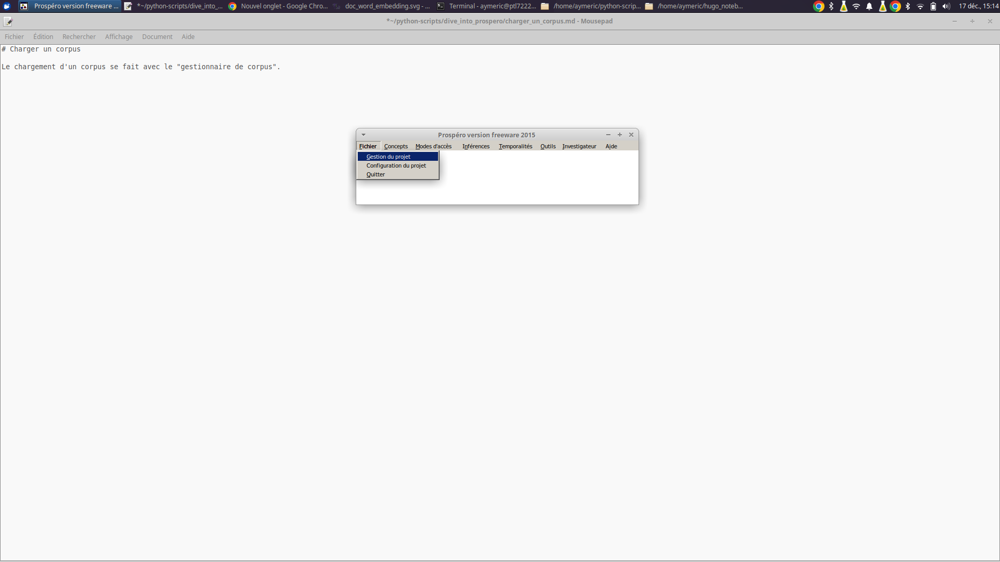
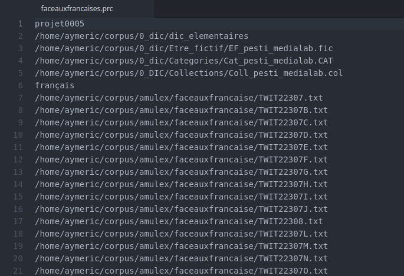
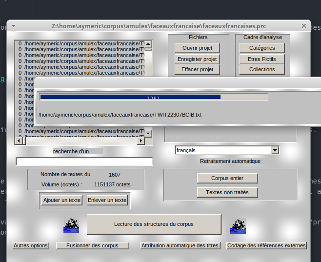

# Charger un corpus

Le chargement d'un corpus se fait avec l'outil de "gestion de corpus" qui se trouve sous l'onglet "Fichier".




Une fois dans le gestionnaire de projet, on observe deux cadrans. À gauche, le cadran affiche l'adresse des textes du corpus. Pour le moment il est vide. À droite, le cadran affiche l'adresse des dictionnaires. Si Prospéro a été configuré, vous devez d'ailleurs voir l'adresse correspondant au dossier contenant les dictionnaire.

Il y a plusieurs façons pour ajouter des textes.

1. On peut les ajouter un à un

2. Il est possible de "glisser-déposer" une liste de textes dans le cadran de gauche

3. En ouvrant un projet déjà existant. On utilise pour cela un fichier ".prc".


Une fois les textes ajoutés, on ajoute les dictionnaires de concepts si on en a, c'est-à-dire le dictionnaire des êtres fictifs, des catégories et des collections. On peut ensuite enregistrer le projet. Cela créera un fichier ".prc".


## Zoom sur le fichier ".prc"

Le fichier ".prc" (pour Projet de corpus) contient deux types d'information : l'adresse des dictionnaires utilisés et l'adresse des textes du corpus. C'est ce fichier qu'on utilise quand on charge un corpus en utilisant la fonction "ouvrir un projet" et qu'on crée lorsqu'on enregistre un projet.



Ainsi quand on s'échange des corpus, il ne faut pas oublier de joindre le fichier ".prc" pour être sûr de travailler sur les mêmes textes et les mêmes dictionnaires. Par exemple, imaginons que je veux partager un corpus avec Waldir. La première fois, je lui enverrais l'ensemble des textes, ainsi que mes dictionnaires et le fichier "prc". Waldir aura plus qu'à ouvrir ce fichier dans Prospéro en vérifiant au préalable que les adresses des fichiers correspondent bien à leur emplacement sur son ordinateur. Si ce n'est pas le cas, il faudra d'abord remplacer l'adresse inscrite dans le fichier par le bon chemin.

````{margin}
```{note}
En langage Prospéro, on parle de sous-corpus pour désigner des textes qu'on a séparé du corpus général, puis regroupés ensemble parce qu'ils ont été produits par le même auteur, utilisent le même être-fictif, etc.
```
````

Ensuite, si Waldir a crée un "sous-corpus" au cours de sa session de travail sans ajouter de texte, il lui suffira de me transmettre uniquement le "prc" pour que je reparte du même point que lui. Par contre, s'il a ajouté un texte ou modifié les dictionnaires, Waldir devra également m'envoyer le nouveau texte et les dictionnaires modifiés.


## Traiter et lecture des structures du corpus

Une fois les textes et les dictionnaires chargés, le corpus sauvegardé, on peut "traiter" le corpus en cliquant sur "corpus entier". En faisant cela, on va créer un nouveau fichier appelé ".bdt" dans lequel Prospéro "enregistre" les traitement qu'il a appliqué sur les textes. Ce sont ces fichiers que Prospéro analyse ensuite lorsqu'on clique sur "lecture des structures du corpus". Ce process implique deux choses :

1. Quand on crée une nouvelle expression, il faut retraiter le corpus pour mettre à jour les structures du corpus

2. En revanche, si on a pas apporté de changement particulier et que les bdt existent déjà, on peut directement lire les structures du corpus.


