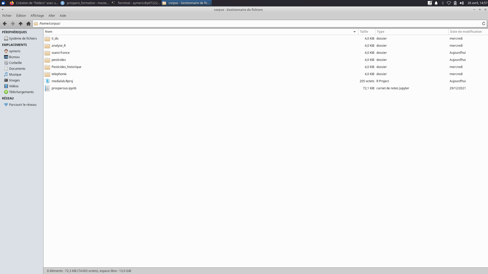

<style type="text/css">

entite{
  background-color: yellow;
}

qualite{
  background-color: pink;
}

marqueur{
  background-color: #33FFF0;
}

epreuve{
  background-color: #4cff33;
}

motoutil{
  background-color:  #ec7063 ;
}

table {
    border-collapse: separate;
    border-spacing: 5px;
  }

td{
    font-size:12pt;
    vertical-align: top;
    padding-left: 1;
    padding-right: 1;
  }

tr:hover {background-color: coral;}

</style>


# Configuration de Prospéro

## Préparation de "l'environnement de travail" {#workdirectory}

Une fois l'installation de Prospéro terminée, voici quelques conseils pratiques visant à faciliter aux mieux l'utilisation de Prospéro.


### Un même emplacement pour tout les corpus

1. Créer un dossier "corpus" au plus proche du répértoire racine. L'objectif est d'éviter d'aller fouiller au fond des dossiers pour trouver un dictionnaire ou un texte. Par exemple

  - **Windows** : `c:/corpus/`

  - **Mac Os** : `PlayOnMac/wineprefix/playonmac/drive_c/corpus`

  - **Linux** : `/home/corpus` (sur Linux il est conseillé de créer le dossier "corpus" dans **/home**, car sur beaucoup d'installations linux l'essentiel de l'espace disque est attribué à cet emplacement. On peut vérifier en faisant "df -h").


2. À l'intérieur de ce dossier général "corpus", on peut créer ensuite autant de "sous-dossiers" que de corpus analysés. Dans l'image ci-dessous, on a ainsi plusieurs sous-dossiers : "pesticides", "pesticides_historiques", "telephonie", etc. Chacun des ces sous-dossiers contiennent les textes du corpus correspondant. Ainsi, dans le dossier "pesticides", ce sont des textes qui parlent de pesticides publiés après 2007, tandis que "pesticides_historiques" contient des textes publiés avant 2007.



3. Enfin, une pratique généralement adoptée par les utilisateurs et utilisatrices de Prospéro consiste à découper un corpus en sous-corpus regroupant d'un côté les articles de presse, de l'autre les questions parlementaires ou la littérature grise (rapport). Cela se traduit par la création une nouvelle fois de "sous-dossiers" à l'intérieur des dossiers de chaque corpus comme illustrée par l'image ci-dessous:


4. Le dernier dossier qu'il est important de créer est celui qui contiendra les dictionnaires utilisés pour analyser les corpus. Ici, nous conseillons (mais ce n'est pas obligatoire) de nommer le dossier *0_dic* pour des raisons uniquement pratiques (en nommant ainsi votre dossier, vous êtes sûr de le retrouver en haut de la liste des dossiers lorsque vous devrez charger les dictionnaires). Comme le montre l'image ci-dessous, plusieurs dossiers "0_dic" peuvent être à des endroits différents. Par exemple, le premiet dossier `/home/0_dic` contient les dictionnaires génériques qui sont utilisés pour analyser plusieurs corpus différents. Tandis que le dossier `/home/pesticides/O_dic_pest` contient les dictionnaires construits spécifiquement pour le corpus "pesticides".


  - Encore une fois, il est pratique de créer un sous-dossier pour chaque type de dictionnaire (être-fictifs, catégories, collections). On verra plus loin à quoi correspondent ces différents types de dictionnaire.

      - collections (contient les fichiers .col)
      - categories  (contient les fichiers .cat)
      - etre_fictifs  (contient les fichiers .fic)
      - dic_elementaires (contient les fichiers .dic)


5. Donc si on résume, l'architecture de l'espace de travail sera le suivant :

  - Linux

```
/home
    |_ /corpus
          |_ /0_dic
                |_ /collections
                |_ /categories
                |_ /etre_fictifs
                |_ /dic_elementaires

          |__ /sous-corpus 1 (ex: pesticides_historique)
          |__ /sous-corpus 2 (ex: pesticides)
                      |_ /Presse
                      |_ /Questions parlementaires
                      |_ /Rapports
                      |_etc.

```

  - Windows

  ```
  c:
    |_ /corpus
          |_ /0_dic
                |_ /collections
                |_ /categories
                |_ /etre_fictifs
                |_ /dic_elementaires

          |__ /sous-corpus 1 (ex: pesticides_historique)
          |__ /sous-corpus 2 (ex: pesticides)
                      |_ /Presse
                      |_ /Questions parlementaires
                      |_ /Rapports
                      |_etc.

```


  - Mac Os

  ```
  PlayOnMac/wineprefix/playonmac/drive_c
    |_ /corpus
          |_ /0_dic
                |_ /collections
                |_ /categories
                |_ /etre_fictifs
                |_ /dic_elementaires

          |__ /sous-corpus 1 (ex: pesticides_historique)
          |__ /sous-corpus 2 (ex: pesticides)
                      |_ /Presse
                      |_ /Questions parlementaires
                      |_ /Rapports
                      |_etc.

```


```{warning}
Tous ce que nous venons de dire sont des "conseils pratiques" destinés à fluidifier autant que possible le travail avec Prospéro. Ils sont tirés de notre utilisation quasi quotidienne du logiciel depuis 10 ans. Néanmoins, libre à vous de les suivre ou pas en fonction de vos habitudes de travail. L'essentiel est de retenir l'emplacement des corpus sur votre machine, car vous en avez besoin pour configurer Prospéro.

```


### Configuration initiale du logiciel


Sur cette fenêtre, il faut remplir les quatre premiers champs avec l'adresse correspondant à l'élément. Cette adresse dépend de l'emplacement de vos fichiers. On prendra ici l'exemple de l'espace de travail construit dans la section précédente :

- Adresse des dictionnaires (*.dic) -- il s'agit ici de l'adresse du fichier dans lequel se trouve l'ensemble des fichiers ".dic". Dans notre exemple l'adresse de ces fichiers est : `/home/corpus/0_dic/dic_elementaires`

- Adresse du fichier des prénoms -- un dictionnaire a été créé spécialement pour répertorier les prénoms et pouvoir les repérer dans les textes. Dans notre exemple, son adresse est :
`/home/corpus/0_dic/dic_elementaires/prenoms.dic`

- Adresse du fichier des unités de mesure:
`/home/corpus/0_dic/dic_elementaires/um.dic`

- Le quatrième champ correspond à la table de codification des noms de fichier. Elle permettra plus tard de renseigner automatiquement un ensemble de métadonnées : nom et type de support, date.
`/home/corpus/0_dic/codex.cfg`


Ça y est, Prospéro est bien configuré. Vous pouvez fermez la fenêtre de configuration et passer à la création de votre premier projet.

### Création d'un projet

- Dans la fenêtre principale, cliquez sur "Fichier", puis sur "Gestion de projet";
1. Il faudra tout d'abord indiquer à Prospéro quel est votre cadre d'analyse, c'est à dire, quel jeu de concepts vous mobilisez dans le projet en question. Pour cela:
    - Cliquez sur "Catégories", en haut à droite;
        - Vous voyez la fenêtre "État des catégories", qui est vide. Cliquez sur "Ouvrir";
        - Sélectionnez le fichier categories.cat, qui se trouve dans le dossier des dictionnaires indiqué plus haut, et cliquez sur "Ouvrir";
        - La fenêtre "État des catégories" a dû se remplir. Fermez-la en clicant sur le X en haut à droite.

    - Repétez le processus pour "Êtres Fictifs", puis pour "Collections";

2. Votre fenêtre de gestion de projet doit maintenant avoir quatre lignes d'indication d'adresse, à droite;

3. Glisser vos fichiers txt appartenant au corpus voulu sur la partie gauche de la fenêtre, ou alors ajoutez des textes en cliquant sur le bouton "Ajouter un texte";
    - Vous devez maintenant voir les chemins des fichiers ajoutés dans la partie gauche de la fenêtre.

4. N'OUBLIEZ PAS d'enregistrer votre projet, en cliquant sur le bouton prévu à cet effet et en choisissant un nom pour votre projet;

5. Vous pouvez maintenant fermer Prospéro et le rouvrir pour voir si tout va bien:
    - Cliquez sue "Fichier", puis sur "Gestion de projet";
    - Cliquez sur "Ouvrir projet", sélectionnez le projet que vous venez de créer et cliquez sur "Ouvrir";
    - Si tout va bien, vous verrez les chemins indiqués de vos fichiers texte et des votre cadre conceptuel.
